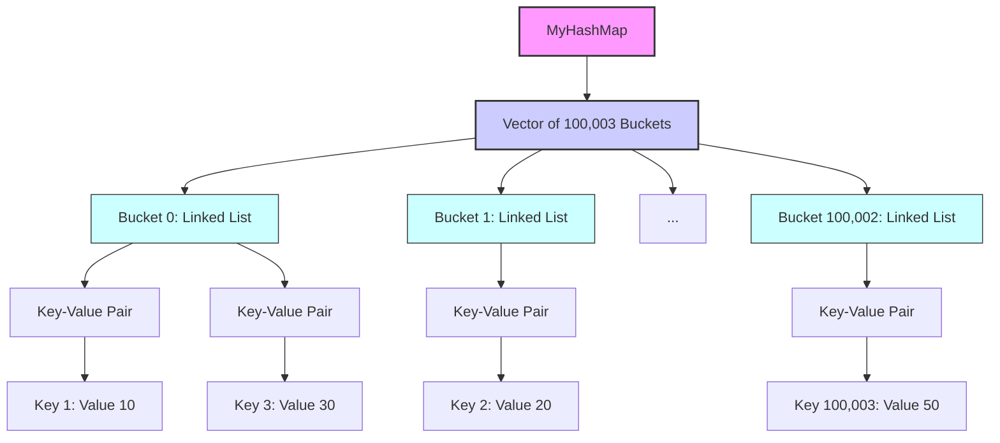

# HashMap Implementation

This project implements a simplified version of a HashMap data structure from scratch in C++. The implementation provides efficient key-value storage and retrieval with average-case O(1) time complexity for all operations, without using any built-in hash table libraries.

## Features

- **Put Operation**: Insert or update key-value pairs
- **Get Operation**: Retrieve values by key with -1 for missing keys
- **Remove Operation**: Delete key-value pairs from the map
- **Efficient Design**: Average-case O(1) time complexity for all operations
- **Collision Handling**: Separate chaining with linked lists
- **Prime Bucket Count**: 100,003 buckets for optimal distribution

## Architecture



## Performance Characteristics

| Operation | Average Case | Worst Case |
|-----------|--------------|------------|
| `put()`   | O(1)         | O(n)       |
| `get()`   | O(1)         | O(n)       |
| `remove()`| O(1)         | O(n)       |

*Note: Worst-case performance only occurs with significant hash collisions, which is minimized by using a prime number of buckets (100,003)*

## Getting Started

### Prerequisites

- C++ compiler (g++ or equivalent)
- Make (optional)

### Compilation and Execution

1. **Compile the source code**:
   ```bash
   g++ HashMap.cpp -o HashMap
   ```

2. **Run the executable**:
   ```bash
   # Linux/Mac
   ./HashMap
   
   # Windows
   .\HashMap.exe
   ```

### Example Output
```
obj.get(1): 10
obj.get(3): -1
obj.get(2): 30
obj.get(2): -1
```

## Code Structure

The implementation consists of a single class with the following components:

```cpp
class MyHashMap {
private:
    const static int bucket_count = 100003;  // Prime number of buckets
    vector<list<pair<int, int>>> buckets;    // Vector of linked lists

public:
    MyHashMap();             // Constructor
    void put(int, int);      // Insert/update key-value pair
    int get(int);            // Retrieve value by key
    void remove(int);        // Delete key-value pair
};
```

### Key Components

1. **Buckets Array**:
   - Fixed-size vector with 100,003 elements
   - Each element is a linked list for collision handling

2. **Hash Function**:
   - Simple modulo operation: `key % bucket_count`
   - Ensures uniform distribution of keys

3. **Collision Resolution**:
   - Separate chaining using linked lists
   - Each bucket contains a list of key-value pairs

4. **Operations**:
   - **put()**: Updates existing keys or appends new pairs
   - **get()**: Searches bucket chain for target key
   - **remove()**: Deletes key-value pair if found

## Testing

The implementation includes built-in test cases that verify:
- Basic insertion and retrieval
- Handling missing keys
- Value updates
- Key removal
- Collision handling

To add more tests, modify the `main()` function in the source code.

## Design Choices

1. **Prime Bucket Count (100,003)**:
   - Larger than maximum operations (100,000)
   - Minimizes collisions through better distribution
   - Reduces likelihood of clustering

2. **Separate Chaining**:
   - Simple collision resolution method
   - Efficient for moderate load factors
   - Allows dynamic growth of chains

3. **Standard Library Containers**:
   - Uses `vector` and `list` for efficient memory management
   - Avoids manual memory allocation/deallocation
   - Maintains O(1) average complexity

## Limitations

1. **Fixed Bucket Count**:
   - Doesn't dynamically resize with load factor
   - Performance degrades if operations exceed 100,000

2. **Integer Keys Only**:
   - Designed specifically for integer keys
   - Would require modification for other data types

3. **Simple Hash Function**:
   - Basic modulo hashing works for integers
   - Not suitable for other data types without modification
